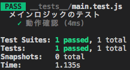
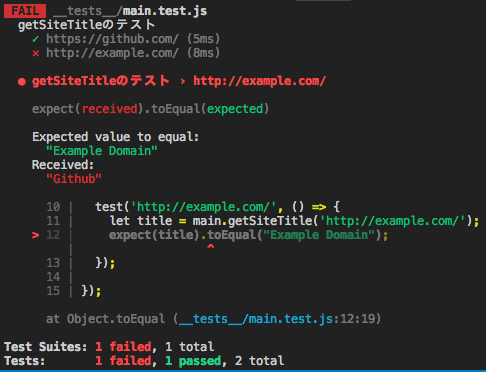
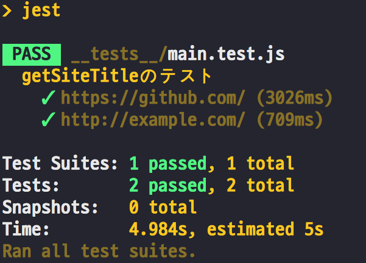
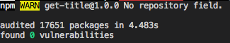
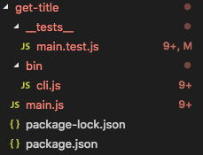
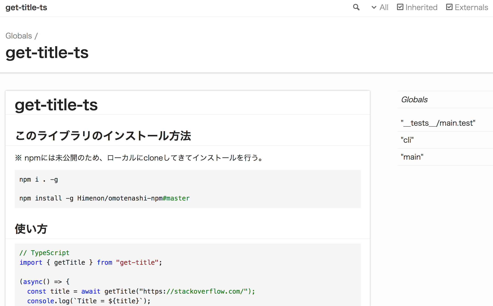
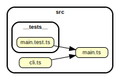

title: <small>おもてなしnpmライブラリをつくろう</small>
class: animation-fade
layout: true

<!-- This slide will serve as the base layout for all your slides -->
.bottom-bar[
  {{title}}
]

---

class: impact

# {{title}}
## @Himenon

version 1.0.0

---

# 自己紹介

* 大学院まで物理専攻
* 社会人2年目
* 銀座にいるフロントエンドエンジニア
* サポーターズでは何度か話している

## 好きなもの

* カメラ / バイク（乗りたい）
* ライブラリを探す（最近はnpm系）

---

# 今日話すこと

* 開発環境について
* npmライブラリとは
* npmライブラリを作ってみる
* 「おもてなし」を実装していく

---

# サンプルコード

* https://github.com/Himenon/omotenashi-npm

---

# 開発環境について

.col-6[
### Editor

- [Visual Studio Code](https://code.visualstudio.com/)
- [Settings Sync](https://marketplace.visualstudio.com/items?itemName=Shan.code-settings-sync)
  - [設定例(Gistのリンク)](https://gist.github.com/Himenon/51f9cdfd94bc84bf9c7b827ae7d8f748)
]

.col-6[
### Library
- Node = 9.8.0
- npm = 6.4.1
]

.col-12[
- Visual Studio Codeは初期設定でも補完が優秀なのでオススメです
- Nodeとnpmが入っていればどのOSでも構いません
]

---

# npmライブラリとは

## JavaScript製のパッケージマネージャー

```bash
# 例えば
npm install -g web2pdf
```

**参考**
- https://www.npmjs.com/
- https://www.npmjs.com/package/web2pdf

---

# npmのQ&A

--

* よくわからない
  * **ほぼ** `package.json`に書いてあるので１つずつ読んでいく
--

* 難しい？
  * ~~凝ったことをしなければ~~ 簡単
--

* 開発で使うにはどんなメリットがあるの？
  * 責務分離 → 1つのことに、集中できるようになる

---

class: impact

# お題
## RLを入力するとサイトタイトルを取得するCLI

まずは作ってみる

---

# まずは作りましょう

.col-3[
初期化
```bash
npm init
```
]
.col-9[
<small>
```json
{
  "name": "get-title",
  "version": "1.0.0",
  "description": "URLを入力するとサイトタイトルを取得するCLI",
  "main": "./main.js",
  "scripts": {
    "test": "jest"
  },
  "author": "Himenon",
  "license": "MIT",
}
```
</small>
]

---

# <small>CLI用のエントリーポイントを置く</small>

```txt
get-title
├── bin
│   └── cli.js   // ここ
└── package.json
```

---

# package.jsonにエンリーポイントを記述する

CLI化するポイント

```json
"bin": {
  "get-title": "./bin/cli.js"
}
```

`npm install`したときに、`get-title`として使える

---

# シンプルに作る

<small>
```js
// ./bin.cli.js
#!/usr/bin/env node
function main(url) {
  console.log(url);
}
main(process.argv[2]);
```
</small>

試してみる

<small>
```sh
$ node ./bin/cli.js https://github.com
https://github.com
```
</small>

`process.argv=["node", "./bin/cli.js", "https://github.com"]`

---

# ローカルにインストールしてみる

<small>
```sh
npm i -g .
```

```sh
$ get-title https://github.com
https://github.com
```
</small>

`npm link`を叩くとどこにインストールされているかわかります。

<small>
```txt
/usr/local/bin/get-title -> /usr/local/lib/node_modules/get-title/bin/cli.js
/usr/local/lib/node_modules/get-title -> /path/to/get-title
```
</small>

* https://docs.npmjs.com/cli/link

---

# テストを追加する

[jest](https://github.com/facebook/jest)を使う

```sh
npm i -D jest
npx jest init
# 勝手に初期化してくれうr
```

* [ちゃんと使い分けてる? dependenciesいろいろ。 \- Qiita](https://qiita.com/cognitom/items/acc3ffcbca4c56cf2b95)

---

# 実はこのままだとテストしづらい

```js
function main(url) {
  console.log(url);
}

main(process.argv[2]); // ここが走ってしまう
```

`main`関数の分離をしておく

---

# ファイル分割

```js
// ./main.js
function getTitle(url) {
  console.log(url);
}

exports.getTitle = getTitle;
```

```js
// ./bin/cli.js
#!/usr/bin/env node
const main = require('../main');

main.getTitle(process.argv[2]);
```

---

# 整理

```txt
get-title
├── bin
│   └── cli.js       # CLIのエントリーポイント
├── main.js          # メインロジック
└── package.json
```

---

# テストを書く

```txt
get-title
├── bin
│   └── cli.js       # CLIのエントリーポイント
├── main.js          # メインロジック
├── __tests__
│   └── main.test.js # メインロジックのテスト
└── package.json
```

`jest`のデフォルト設定で今回は行います。

---

# テストの動作確認

```js
// __tests__/main.test.js
describe('メインロジックのテスト', () => {
  test('動作確認', () => {
    expect(1).toEqual(1);
  });
});
```

```json
// package.json
"scripts": {
  "test": "jest"
},
```

---

# テストの動作確認

```sh
npm run test
```



動作確認が終わってから、ロジックのテストを書くようにすると、気が楽です。

---

# テストできるコードにする

`getTitle`の返り値を指定する

```diff
// main.js
function getTitle(url) {
-  console.log(url);
+  return 'The world’s leading software development platform · GitHub';
}

exports.getTitle = getTitle;
```

---

# テストする

<small>
```js
const main = require('../main');

describe('getTitleのテスト', () => {
  test('https://github.com/', () => {
    const title = main.getTitle('https://github.com/');
    expect(title).toEqual('The world’s leading software development platform · GitHub');
  });
});
```
</small>

.col-6[
  `npm run test`で確認する
]
.col-6[
  
]

---

# テストを追加する

<small>
```js
test('http://example.com/', () => {
  const title = main.getTitle('http://example.com/');
  expect(title).toEqual("Example Domain");
});
```
</small>

.col-6[
* 今のままだと落ちます
]
.col-6[
  
]

---

# <small>テストが通過するように実際のロジックを書く</small>

Headless Chromeの[puppeteer](https://github.com/GoogleChrome/puppeteer)を使う

```sh
npm i puppeteer
```

* <https://github.com/GoogleChrome/puppeteer>
* <https://pptr.dev/>

---

# タイトルを取るロジックを書く

<small>
```js
const puppeteer = require('puppeteer');

async function getTitle(url) {
  const browser = await puppeteer.launch(); // puppeteerの起動
  const page = await browser.newPage();     // ブラウザタブの用意
  await page.goto(url);                     // 指定したURLを開く
  const title = await page.title();         // ページタイトルの取得
  await browser.close();                    // ブラウザを閉じる
  return title;                             // タイトルを返す
}

exports.getTitle = getTitle;
```
</small>

* Githubの[Usage](https://github.com/GoogleChrome/puppeteer#usage)をほぼコピペ

---

# テストを実行する

.col-6[
```sh
  npm run test
```
* テストが通過します
]
.col-6[
  
]

---

# CLIの修正をする

`bin/cli.js`

<small>
```diff
#!/usr/bin/env node
const main = require('../main');

- main.getTitle(process.argv[2]);
+ (async() => {
+   const title = await main.getTitle(process.argv[2]);
+   console.log(title);
+ })();
```
</small>

動作確認を忘れずに。

---

# 公開する

ざっくりといえば、次の手順を踏めば公開できます。

1. <https://www.npmjs.com/>に行き、ユーザー登録をする
2. ローカルで`npm login`をして認証を通す
3. 公開したいライブラリの`package.json`がある位置で`npm run publish`を実行

※ 今回は行いません。

---

class: impact

# おもてなしを実装
## これで終わりではない。

ここからが本番

---

# <small>作ったライブラリに「おもてなし」を実装しよう</small>

<div style="height: 1em"></div>

.col-6[
## <small>ユーザーに対して</small>
* **インストール方法**
* **使い方**
* サンプルコードを用意する
]
.col-6[
## <small>開発者に対して</small>

* 開発環境の構築方法
* テストの方法を書く
* **package.jsonを詳しく書く**
]

* ドキュメントやpackage.jsonが充実していることが極めて重要
* 一度作ってしまえば、使い回しが効くので最初だけ頑張ればよい

---

# ユーザーに対するおもてなし

**最高のUX**

.col-6[
## インストール
<small>
```bash
npm install [package]
```
</small>
]
.col-6[
## 動くサンプルコード
<small>
```js
const hoge = require('hoge')
hoge();
```
</small>
]

---

# 開発者に対するおもてなし

**最高のUX**

.col-4[
## 環境構築
<small>
```bash
git clone [repository]
npm install
npm start
```
</small>
]
.col-4[
## テスト
<small>
```bash
npm run test
```
</small>
]
.col-4[
## ビルド
<small>
```bash
npm run build
```
</small>
]

---

# 何を・どうやって実装するか？

* package.jsonの仕組みをフルに使う
* vscodeの仕組みをフルに使う
* 世の中にある便利なライブラリをフルに使う

.col-4[
<br>
`npm i`をしたとき
]
.col-4[
<br>
<span style="color: red;">**真っ赤**</span>
]

---

# おもてなしリスト

* package.jsonの充実化
* サンプルコードを設置する
* .npmrc / .npmignoreを使う
* babelによるトランスパイル
* Linter / Prettier
* 型 TypesScript / FlowType
* ドキュメントを用意する
* 依存関係を監視する
 
---

# package.jsonの充実化 その1
<small>
```json
{
  "scripts": {
    "start": "run-p *:watch",
    "clean": "rimraf lib",
    "prebuild": "npm run clean",
    "build": "babel src --out-dir lib --ignore 'src/__tests__/*.test.js'",
    "build:watch": "npm run build -- --watch",
    "doc": "npx esdoc",
    "lint": "npx eslint src/**/*.js",
    "lint:fix": "npx eslint --fix \"src/**/*.js\"",
    "test": "jest",
    "test:jest": "jest",
    "test:watch": "npm run test:jest -- --watch",
    "prettier": "prettier --write \"**/*.{js,jsx,ts,tsx,css}\""
  }
}
```
</small>

---

# package.jsonの充実化 その2

<small>
```json
{
  "repository": "git@github.com:Himenon/omotenashi-npm.git",
  "engines" : {
    "node" : "<=v6.4.0",
    "npm": "<=6.4.0"
  },
  "os" : [ "darwin", "linux", "!win32" ],
  "directories": {
    "lib": "lib",
    "example": "sample"
  },
  "typing": "./lib/index.d.ts"
}
```
</small>

<https://docs.npmjs.com/files/package.json>

---

# <small>サンプルコード</small>

動くコードが真

.col-6[
<small>
```txt
get-title
├── package.json
├── src
│   ├── cli.ts
│   └── main.ts
└── sample
    ├── package.json // ここから親のpackageをinstallする
    ├── src
    └── tsconfig.json
```
</small>
]
.col-6[
<small>
```json
// package.json
"dependencies": {
  "get-title": "file:.."
}
```
</small>
]
.col-12[
<small>ビルドした後に、dependenciesを直で書いてインストールする</small>
]

---

# .npmrc / .npmignore

環境設定を迷わせない

<small>
* .npmrc
  * プロジェクトの構成管理

* .npmignore
    * `npm pack`や`npm publish`ときにignoreするファイル
    * .gitignoreと同じ規則
        * 開発で必要だけど、publishに不要なものを除外するときに使う

* https://docs.npmjs.com/files/npmrc
* https://docs.npmjs.com/misc/developers

</small>

---

# babelによるトランスパイル

新しい文法を使いつつ、後方互換性を保つ

* babelを使う
    * 最新の構文が対応していない場合が往々にしてある

* <https://kangax.github.io/compat-table/>

---

# Linter / Prettier

<small>
「インデント」や「シングル・ダブルクォート」の議論は不毛

* [eslint](https://github.com/eslint/eslint) / [tslint](https://github.com/palantir/tslint)
* 構文の整形(矯正)
    * 本質的な議論に集中することができる
* [prettier](https://github.com/prettier/prettier)
    * 対象となる形式がいろいろ。eslint、tslintと併用する。

```bash
eslint --fix src/**/*.js

tslint -c tslint.json -p tsconfig.json --fix
```

設定で困ったら`"eslint:recommended"`、`"tslint:recommended"`を使う。
</small>

---

# 型 TypesScript / FlowType

型はカンニングシート

<small>
.col-6[
## Pros

* 型安全
* vscodeと相性がいい
* JSを含むプロジェクトでも利用可
]
.col-6[
## Cons

* 慣れが必要
* 環境構築
]

.col-12[
* プロジェクトをどちらに寄せたとしても、OSSを利用しているとどちらも目にする
* TypeScriptはpackage.jsonに型定義ファイルの参照先（`types`）だけ配置することが可能
]
</small>

---

# ドキュメント

.col-6[
自動生成する

* [esdoc](https://esdoc.org/) / [typedoc](https://typedoc.org/)

```bash
# esdoc
esdoc
# typedoc
typedoc --out ./docs/ ./src
```
]
.col-6[

]

---

# 依存関係を確認する

「孤立したコード」や「循環参照」している箇所などをあぶり出す。構造的に不安定なところを検知する

<https://github.com/sverweij/dependency-cruiser>



参考：[dependency\-cruiserを使って依存関係を検証し潜在的なバグを潰す \- Qiita](https://qiita.com/akameco/items/e11023a59026c319b91b)

---

class: impact

# まとめ

時間が余ればサンプルコードで解説します

---

# まとめ

* 利用者に対してのおもてなし
  * README
  * サンプルコード
  * ドキュメント
* 開発者に対してのおもてなし
  * テスト
  * npm `start / test / build`

---

# もっとおもてなししたい

- CI/CD
- 文法チェック
- フォーマッタ
- コミットフォーマッタ
- TypeScript
- マルチパッケージ管理

---

# 開発をサポートするライブラリ

紹介しきれないので、リンクだけ
<small>
.col-6[
* [commitlint](https://github.com/marionebl/commitlint)
* [pre-commit](https://github.com/observing/pre-commit)
* [lint-staged](https://github.com/okonet/lint-staged)
* [cspell](https://github.com/Jason3S/cspell)
* [dependency-cruiser](https://github.com/sverweij/dependency-cruiser)
* [danger-js](https://github.com/danger/danger-js)
* [node-install-local](https://github.com/nicojs/node-install-local)
* [npm-run-all](https://github.com/mysticatea/npm-run-all)
]
.col-6[
* [meow](https://github.com/sindresorhus/meow)
* [chalk](https://github.com/chalk/chalk)
* [generate-changelog](https://github.com/lob/generate-changelog)
* [chokidar](https://github.com/paulmillr/chokidar)
* [opn](https://github.com/sindresorhus/opn)
* [portfinder](https://github.com/indexzero/node-portfinder)
* [update-notifier](https://github.com/yeoman/update-notifier)
* [jest-puppeteer](https://github.com/smooth-code/jest-puppeteer)
]
</small>

探せばたくさん出てきます。

---

# 最後に

* 小さいうちに先手を打つこと
    * 後から導入するものが大変なものもある
* 開発のUXを損ねないように、ドキュメントの整備を行う
    * 暗黙的に使うコマンドに処理をフックさせておくのも手

* コードの保守がもっとも大変。
    * 便利なツールをどんどん使って試していく

---

class: impact

# おわり
